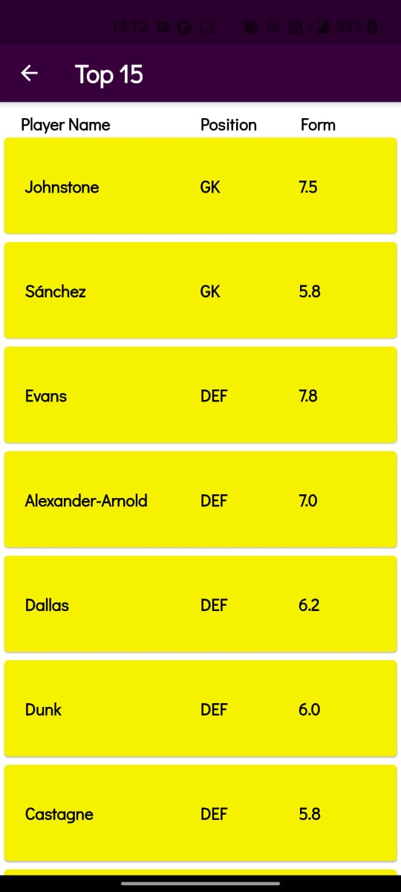
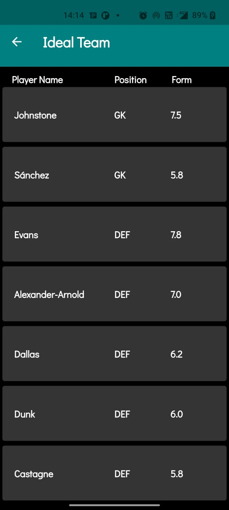

# SEPM Project 
Submitted By :
- Advaith Suresh (RA1911003010604)

- Abhigyan Singh (RA1911003010607)

- Suraj Mishra (RA1911003010611)

<h2 align= "left"><b>Project Description</b></h2>
Fantasy Premier League is one of the most popular online fantasy games available. Boasting over 7 million players for the most popular sporting competition in the world and offering exciting prizes to the top players in the world. Players usually rely on their gut instinct formed from experience and a bit of luck to get the maximum possible points for each gameweek. Recently many players have dipped in the realm of data science to ensure best results for themselves and it has proven time and time again to be an effective strategy, as the saying goes, the numbers don’t lie.

<h2 align= "left"><b>Our Product</b></h2>
Our software will automate the data science process and try to give the optimum squads for each week. This hopes to even the playing field and also gives the players a powerful engine to refer from for their own squads. Using flutter and python we will give results and also have extra features for the user to enjoy the app.

<h2 align= "left"><b>A Peek at our App</b></h2>
<h3 align= "left"><b>Light Mode</b></h3>

 &ensp;&ensp;&ensp;&ensp;&ensp;&ensp;&ensp;&ensp;
 &ensp;&ensp;&ensp;&ensp;&ensp;&ensp;&ensp;&ensp; 
 &ensp;&ensp;&ensp;&ensp;&ensp;&ensp;&ensp;&ensp;&ensp;
 &ensp;&ensp;&ensp;&ensp;&ensp;&ensp;&ensp;&ensp;&ensp;
 &ensp;&ensp;&ensp;&ensp;&ensp;&ensp;&ensp;&ensp;&ensp;
 &ensp;&ensp;&ensp;&ensp;&ensp;&ensp;&ensp;&ensp;&ensp;
 &ensp;&ensp;&ensp;&ensp;&ensp;&ensp;&ensp;&ensp;&ensp;

<h3 align= "left"><b>Dark Mode</b></h3>

 &ensp;&ensp;&ensp;&ensp;&ensp;&ensp;&ensp;&ensp;
 &ensp;&ensp;&ensp;&ensp;&ensp;&ensp;&ensp;&ensp; 
 &ensp;&ensp;&ensp;&ensp;&ensp;&ensp;&ensp;&ensp;&ensp;
 &ensp;&ensp;&ensp;&ensp;&ensp;&ensp;&ensp;&ensp;&ensp;
 &ensp;&ensp;&ensp;&ensp;&ensp;&ensp;&ensp;&ensp;&ensp;
 &ensp;&ensp;&ensp;&ensp;&ensp;&ensp;&ensp;&ensp;&ensp;
 &ensp;&ensp;&ensp;&ensp;&ensp;&ensp;&ensp;&ensp;&ensp;

<h2 align= "left"><b>Tech Stack Used</b></h2>

- Flutter

- Python

- Flask

- Pandas

<h2 align= "left"><b>Project Maintainer(s)</b></h2>

<table>
<tr align="center">
  
  <td>
  
Abhigyan Singh

</td>

<td>

Advaith Suresh

</td>

<td>
  
 <td>

Suraj Mishra

</td>
</tr>

  </table>

  
  </h4></a>
